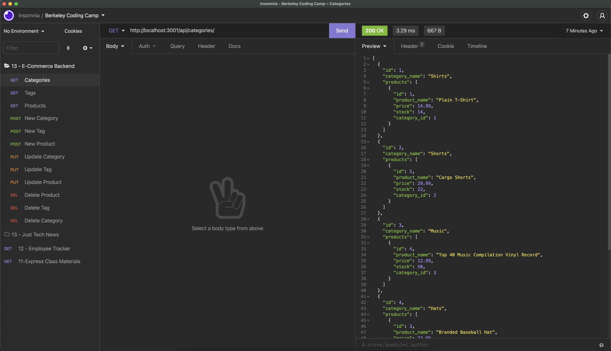

# E-commerce Back End

This E-commerce Back End uses Sequelize to create database tables and connections in JavaScript and saves them to a MySQL database. Once the express server is started, the user can use [Insomnia](https://insomnia.rest/) to run the GET, CREATE, PUT, and DELETE routes in order to make changes to the contents of the database tables.

## Video

[](https://drive.google.com/file/d/1PjX7EuYMnwSp1lAluXvRSOIPU_AcHWO-/view?usp=sharing)

View video of the working application: [Download Local File](https://github.com/JColeCodes/stern-shoppe/raw/main/video/E-commerce%20Back%20End.mp4) | [Google Drive](https://drive.google.com/file/d/1PjX7EuYMnwSp1lAluXvRSOIPU_AcHWO-/view?usp=sharing)

## Table of Contents
* [Installation](#installation)
* [Usage](#usage)
* [Contributing](#contributing)
* [Tests](#tests)
* [Questions](#questions)

## Installation
To install this project, please follow these steps: 
1. Make sure you have [Node.js](https://nodejs.org) and [MySQL](https://dev.mysql.com/downloads/) installed.
2. Through the command line, go to the folder you wish this application's folder to be in.
3. Do `git clone` of the repository to get the application's files.
4. Enter `mysql -u root -p` to open the MySQL shell.
5. Run `source db/schema.sql` to get the database.

This program requires the following packages from npm: 
* [express](https://www.npmjs.com/package/express)
* [mysql2](https://www.npmjs.com/package/mysql2)
* [sequelize](https://www.npmjs.com/package/sequelize)
* [dotenv](https://www.npmjs.com/package/dotenv)

In order to install all of them, enter the following into the command line:
```
npm install
```

## Usage
To run this project, enter the following into the command line:
```
npm start
```

## Contributing
If you would like to contribute to this project, you can do so by:
1. Forking the project. ([Learn how to fork.](https://docs.github.com/en/get-started/quickstart/fork-a-repo))
2. Creating a new feature branch, committing the changes, and pushing the branch.
3. Opening a [Pull Request](https://github.com/JColeCodes/stern-shoppe/pulls).

You can also check the list of [Issues](https://github.com/JColeCodes/stern-shoppe/issues).

Read the [Contributor Covenant Code of Conduct](https://www.contributor-covenant.org/version/2/1/code_of_conduct/).

## Tests
To easily test the GET, PUT, and DELETE routes without manually creating everything, you can seed the database by running the following command:
```
npm run seed
```

## Questions
E-Commerce Back End was created by [JColeCodes](https://github.com/JColeCodes). For inquiries regarding the project, please email the creator at [capauldi@gmail.com](mailto:capauldi@gmail.com).